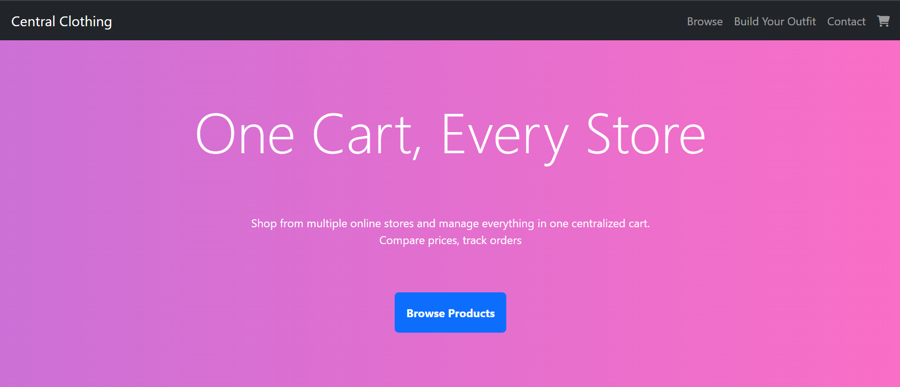

# Project Name - CSC x UPCHackathon
## Description
Website that mergers clothing from different store fronts to be compared.

## Technologies
- Python
- SQLite
- Flask
- Jinja Templating
- BeautifulSoup
- Selenium

## How To Run Locally
1. Install dependencies by `pip install -r requirements.txt`
2. Run `app.py` 
3. Access in browser at `127.0.0.1:5000`

## Screenshots
### Usage

### Landing Page

### Build Your Outfit
